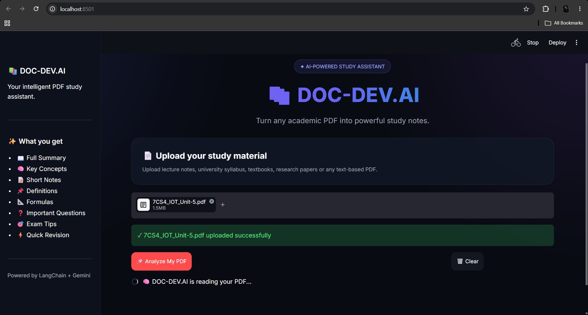
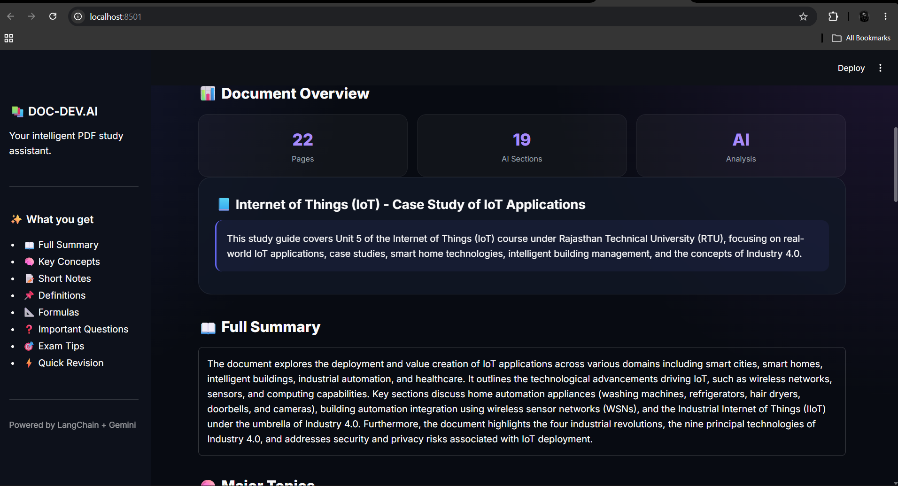
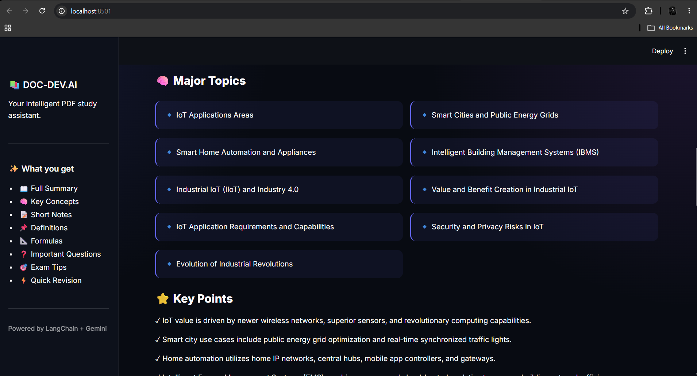
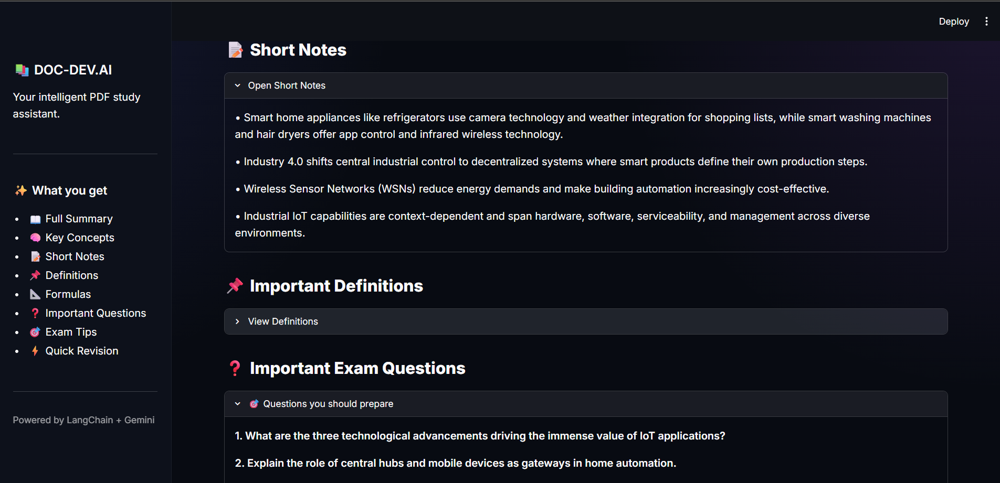

# 📄 DOC-DEV.AI

### AI-Powered PDF Analyzer & Study Assistant

DOC-DEV.AI is an AI-powered PDF analysis application that transforms academic documents into clear, structured and useful study material.

Simply upload a PDF and let AI analyze the document to generate meaningful insights, summaries and study notes.

---

## 🚀 Demo





---

## ✨ Features

- 📄 Upload PDF documents
- 🤖 AI-powered document analysis
- 📝 Generate precise summaries
- 🧠 Extract important concepts
- 📌 Generate short notes
- 📖 Extract definitions
- 📐 Identify important formulas
- ❓ Generate important questions
- 🎯 Exam-oriented insights
- ⚡ Quick revision support
- 🎨 Clean and modern Streamlit UI

---

## 🧠 How It Works

```text
        📄 PDF
          │
          ▼
   ┌─────────────────┐
   │  PDF Document   │
   │     Loader      │
   └────────┬────────┘
            │
            ▼
   ┌─────────────────┐
   │  Text Extraction│
   └────────┬────────┘
            │
            ▼
   ┌─────────────────┐
   │   Gemini LLM    │
   │   AI Analysis   │
   └────────┬────────┘
            │
            ▼
   ┌────────────────────────┐
   │ 📚 Study Material      │
   │                        │
   │ • Summary              │
   │ • Key Concepts         │
   │ • Short Notes          │
   │ • Definitions          │
   │ • Formulas             │
   │ • Questions            │
   │ • Exam Tips            │
   └────────────────────────┘